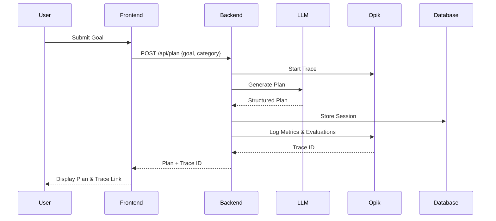

```markdown
# Aletheia 🤖
> Agentic AI Accountability Co-pilot | Hackathon Project

## 🎯 Overview
Aletheia transforms vague New Year's resolutions into actionable, adaptive plans using agentic AI. Unlike basic trackers, it proactively orchestrates tasks, detects friction, and uses Opik's observability to self-optimize.
```
## 🏗️ Architecture

 High-Level Architecture
```
┌─────────────────┐     ┌──────────────────┐     ┌─────────────────┐
│   Next.js 15    │────▶│   FastAPI Backend│────▶│  LLM Provider   │
│   Frontend      │◀────│   (Python)       │◀────│ (Gemini/OpenAI) │
└─────────────────┘     └──────────────────┘     └─────────────────┘
         │                        │                         │
         │                        │                         │
         ▼                        ▼                         ▼
┌─────────────────┐     ┌──────────────────┐     ┌─────────────────┐
│   Vercel        │     │   Railway/Render │     │  Comet Opik     │
│   Hosting       │     │   Hosting        │     │  Observability  │
└─────────────────┘     └──────────────────┘     └─────────────────┘
```
 Data Flow



 Technology Stack
```
Component Technology Purpose
Frontend Next.js 15 (App Router), TypeScript, Tailwind CSS, Shadcn/ui Responsive UI, goal input, plan visualization
Backend FastAPI, Python 3.11+, Pydantic API server, business logic, agent orchestration
AI/ML LangChain, Google Gemini API, OpenAI API LLM orchestration, reasoning chains, tool calling
Observability Comet Opik SDK Tracing, evaluation, experiment tracking
Database SQLite (dev), PostgreSQL (prod) User sessions, goal history, agent interactions
Hosting Vercel (frontend), Railway/Render (backend) Production deployment
Tools GitHub, Linear, Discord Development coordination
```

## 🚀 Quick Start

### Frontend Setup
```bash
cd frontend
npm install
npm run dev
```

Backend Setup

```bash
cd backend
python -m venv venv
source venv/bin/activate  # or `venv\Scripts\activate` on Windows
pip install -r requirements.txt
uvicorn main:app --reload
```

📁 Project Structure

```
aletheia/
├── frontend/
│   ├── app/
│   │   ├── dashboard/
│   │   │   └── page.tsx
│   │   ├── opik-demo/
│   │   │   └── page.tsx
│   │   └── layout.tsx
│   ├── components.json
│   ├── tailwind.config.ts
│   ├── package.json
│   └── .env.local
├── backend/
│   ├── agents/
│   │   ├── planner.py
│   │   └── __init__.py
│   ├── core/
│   │   ├── config.py
│   │   └── opik_setup.py
│   ├── main.py
│   ├── requirements.txt
│   └── .env
├── docs/
│   └── CHECKPOINT_SUBMISSIONS.md
└── README.md
```

🔗 Links
```
· Live Demo: [Coming Soon]
· Opik Dashboard: [Link to your project]
· Hackathon Submission: Encode Club Platform
```
